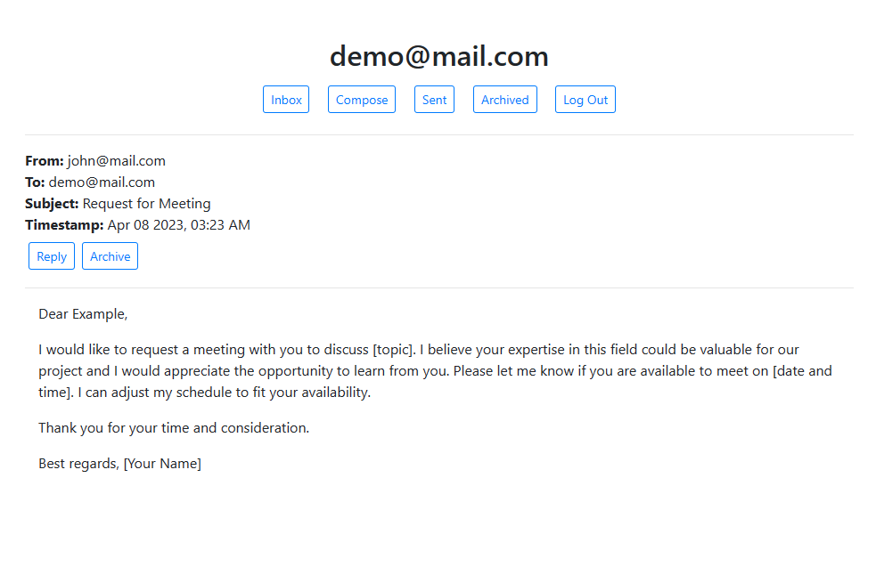
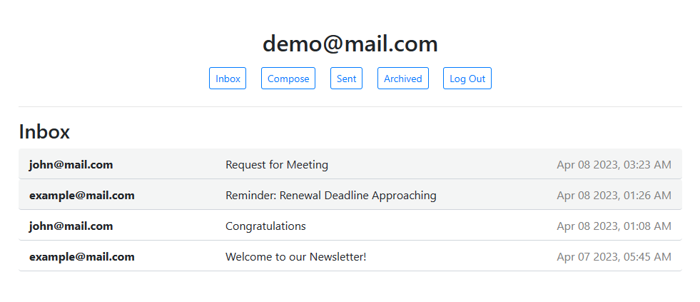

# MailBox

MailBox is an email client web application built using JavaScript, Django, HTML, CSS, and Bootstrap. Users can send, receive, reply to, and archive emails. The app interacts with a Django back-end to perform API calls, allowing users to manage their emails. Emails are stored in a PostgreSQL database.

## Project Summary

The goal of this project is to create a user-friendly email client interface that interacts with a Django back-end. This interface enables users to send and receive emails, which are stored in a database on the server. Users can also archive and mark emails as read or unread.

To learn more about the project, refer to the [assignment description on CS50's OpenCourseWare](https://cs50.harvard.edu/web/2020/projects/3/mail/).

## Technologies

### Back-end:
- Python
- Django

### Front-end:
- HTML
- JavaScript
- CSS
- Bootstrap

### Database:
- PostgreSQL

## API Details

### Email Inbox

- **GET** `/emails/<mailbox>`
  - Retrieves a list of emails from the specified mailbox.
  - Available mailboxes: `inbox`, `sent`, and `archive`.
  - Response: JSON list of email objects.

### Single Email

- **GET** `/emails/<email_id>`
  - Retrieves a single email by its unique ID.
  - Response: JSON representation of the email object.

### Sending Emails

- **POST** `/emails`
  - Sends an email to the server.
  - Request body: JSON object containing recipients, subject, and body.
  - Response: JSON message indicating success or error.

### Marking Emails

- **PUT** `/emails/<email_id>`
  - Modifies an email's archived or read status.
  - Request body: JSON object with `archived` or `read` keys.
  - Values: `true` for archive/read, `false` for unarchive/unread.

## Usage

To run the application locally:

1. Install requirements (Django): `pip install -r requirements.txt`
2. Apply migrations: `python manage.py makemigrations mail` and `python manage.py migrate`
3. Run the app: `python manage.py runserver`
4. Create separate accounts/logins to send emails between them.

## Screenshots

